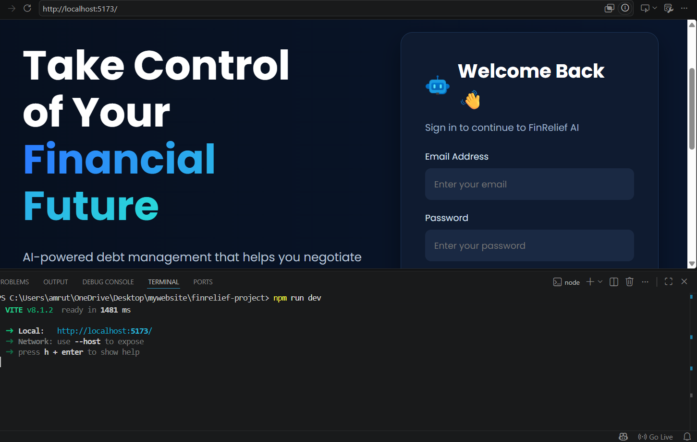
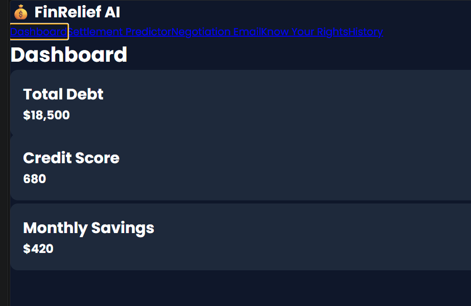
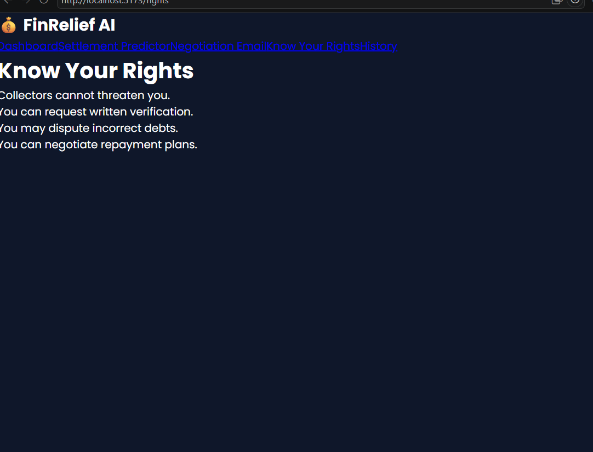
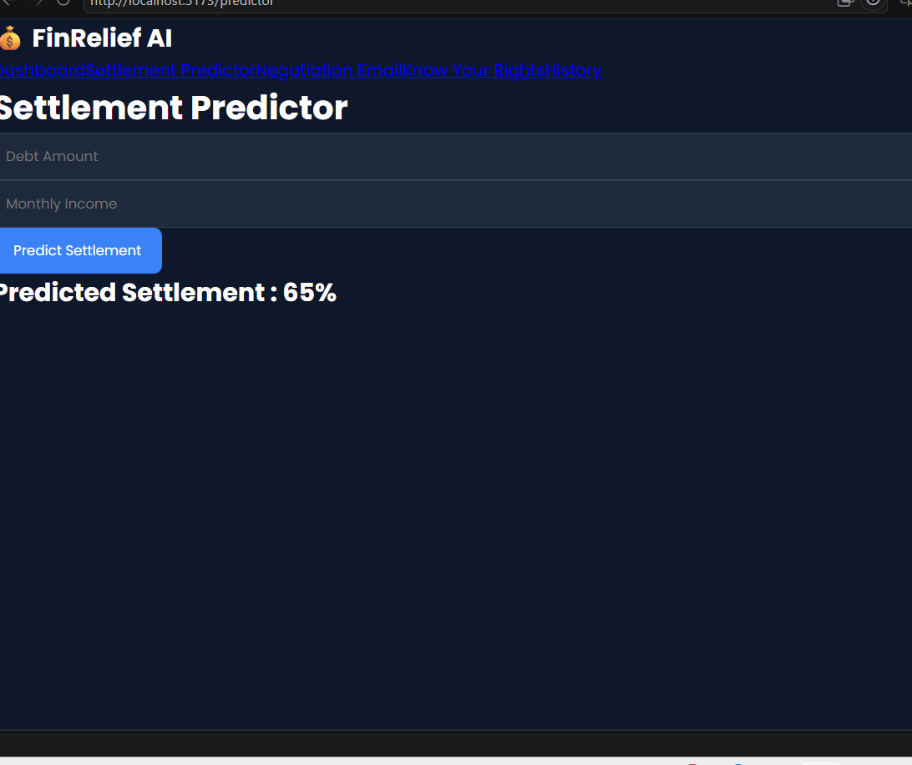
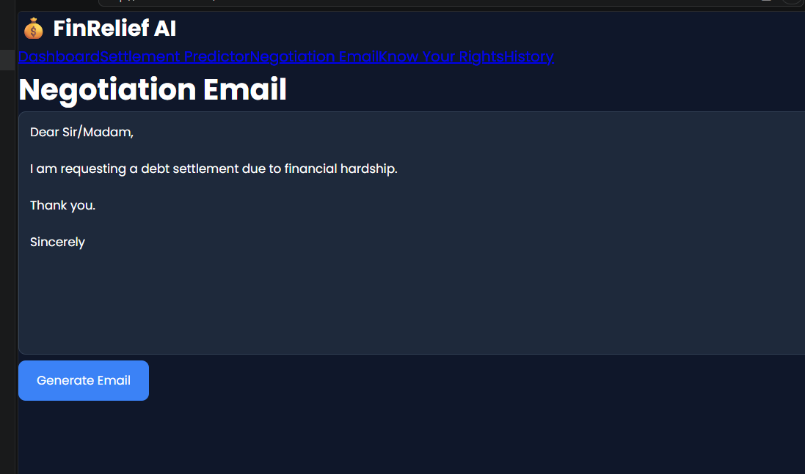
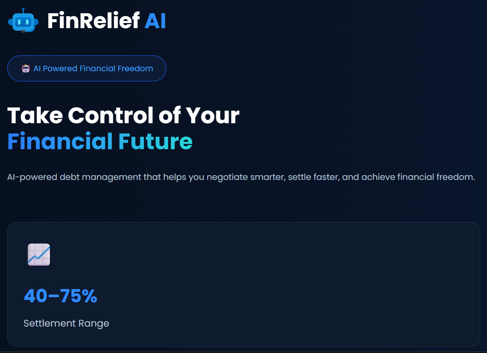

# FinRelief AI – Debt Relief & Financial Recovery Platform

## 📌 Project Overview

FinRelief AI is an AI-powered financial assistance platform that helps borrowers manage their debts, estimate settlement amounts, and receive intelligent negotiation strategies. The application provides a simple, secure, and user-friendly interface for tracking loans and improving financial decision-making.

---

## 🚀 Features

- 🔐 User Registration & Login
- 📊 Interactive Dashboard
- 👤 Financial Profile Management
- 💰 Loan Management
- 📉 Debt Settlement Calculator
- 🤖 AI-Powered Financial Guidance
- 📜 Know Your Rights Information
- 📚 Loan History Tracking
- 📱 Responsive User Interface
- ⚡ Fast Performance with React + Vite

---

## 🛠️ Technologies Used

### Frontend
- React.js
- Vite
- HTML5
- CSS3
- JavaScript (ES6)

### Backend *(if integrated)*
- FastAPI
- Python
- SQLAlchemy
- SQLite
- JWT Authentication

### AI
- Google Gemini API

---

## 📂 Project Structure

```
finrelief-project/
│
├── public/
├── src/
│   ├── components/
│   ├── pages/
│   ├── assets/
│   └── App.jsx
│
├── screenshots/
├── package.json
├── package-lock.json
├── vite.config.js
├── README.md
└── .gitignore
```

---

## 📸 Application Pages

- Home
- Login
- Register
- Dashboard
- Financial Profile
- Loan Management
- Debt Settlement Calculator
- AI Negotiation Strategy
- Know Your Rights
- Loan History

---

## ⚙️ Installation

### Clone the Repository

```bash
git clone https://github.com/amruthachilamkur-del/finrelief-project.git
```

### Move into the Project Folder

```bash
cd finrelief-project
```

### Install Dependencies

```bash
npm install
```

### Run the Development Server

```bash
npm run dev
```

The application will be available at:

```
http://localhost:5173
```

---

## 🎯 Objectives

- Simplify debt management.
- Help borrowers understand repayment options.
- Provide AI-generated financial suggestions.
- Improve financial awareness through educational resources.
- Deliver a modern and responsive user experience.

---

## 🧪 Testing & Validation

- User authentication tested.
- Navigation tested across all pages.
- Form validation implemented.
- Responsive layout verified.
- Error handling tested.
- Dashboard functionality validated.

---

## ⚡ Performance Optimization

- Built using React + Vite for faster loading.
- Component-based architecture.
- Optimized page rendering.
- Efficient routing.
- Responsive UI for desktop and mobile devices.

---

## 👩‍💻 Developer

**Amrutha Chilamkur**

GitHub Repository:

https://github.com/amruthachilamkur-del/finrelief-project

---

## 📄 License

This project was developed for educational and internship purposes.
## 📸 Screenshots

### Login Page


### Dashboard


### Know Your Rights


### Settlement Predictor


### Negotiation Email


### UI Enhancement
